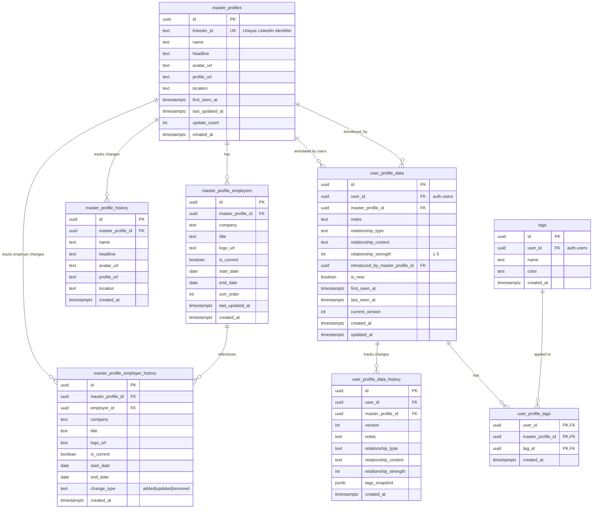

# Social Recall Database Schema

## Architecture Overview

The database uses a **two-tier architecture**:

1. **Master Profiles** (crowdsourced) - Canonical LinkedIn data shared across all users
2. **User Profile Data** (private) - Each user's personal notes, relationships, and tags

This design means:
- LinkedIn profile data is stored once and updated by anyone (no attribution tracking)
- Each user maintains their own private annotations (with full attribution)
- History is tracked for both tiers

**Key difference:**
- **Master profiles**: Changes are anonymous - we track *what* changed, not *who* changed it
- **User annotations**: Full attribution - we always know *who* wrote each note/relationship, and we keep the complete history of their edits

---

## Entity Relationship Diagram



---

## Simplified Visual (for FigJam)

```
┌─────────────────────────────────────────────────────────────────────────────┐
│                        CROWDSOURCED LAYER                                   │
│                    (Shared across all users)                                │
├─────────────────────────────────────────────────────────────────────────────┤
│                                                                             │
│  ┌──────────────────────┐         ┌─────────────────────────────┐          │
│  │   master_profiles    │────────▶│  master_profile_employers   │          │
│  ├──────────────────────┤         ├─────────────────────────────┤          │
│  │ • linkedin_id (UK)   │         │ • company                   │          │
│  │ • name               │         │ • title                     │          │
│  │ • headline           │         │ • logo_url                  │          │
│  │ • avatar_url         │         │ • is_current                │          │
│  │ • profile_url        │         │ • start_date / end_date     │          │
│  │ • location           │         │ • sort_order                │          │
│  │ • update_count       │         └─────────────────────────────┘          │
│  └──────────────────────┘                                                   │
│           │                                     │                           │
│           ▼                                     ▼                           │
│  ┌──────────────────────┐         ┌─────────────────────────────┐          │
│  │ master_profile_      │         │ master_profile_employer_    │          │
│  │ history              │         │ history                     │          │
│  ├──────────────────────┤         ├─────────────────────────────┤          │
│  │ Snapshots of profile │         │ • change_type: added/       │          │
│  │ data over time       │         │   updated/removed           │          │
│  └──────────────────────┘         └─────────────────────────────┘          │
│                                                                             │
└─────────────────────────────────────────────────────────────────────────────┘
                                    │
                                    │ master_profile_id
                                    ▼
┌─────────────────────────────────────────────────────────────────────────────┐
│                          PRIVATE LAYER                                      │
│                    (Per-user annotations)                                   │
├─────────────────────────────────────────────────────────────────────────────┤
│                                                                             │
│  ┌──────────────────────┐         ┌─────────────────────────────┐          │
│  │  user_profile_data   │────────▶│     user_profile_tags       │          │
│  ├──────────────────────┤         ├─────────────────────────────┤          │
│  │ • user_id (FK)       │         │ • user_id                   │          │
│  │ • master_profile_id  │         │ • master_profile_id         │          │
│  │ • notes              │         │ • tag_id ──────────────────▶│──┐       │
│  │ • relationship_type  │         └─────────────────────────────┘  │       │
│  │ • relationship_      │                                          │       │
│  │   context            │         ┌─────────────────────────────┐  │       │
│  │ • relationship_      │         │          tags               │◀─┘       │
│  │   strength (1-5)     │         ├─────────────────────────────┤          │
│  │ • introduced_by      │         │ • user_id                   │          │
│  │ • is_new             │         │ • name                      │          │
│  │ • first/last_seen_at │         │ • color                     │          │
│  │ • current_version    │         └─────────────────────────────┘          │
│  └──────────────────────┘                                                   │
│           │                                                                 │
│           ▼                                                                 │
│  ┌──────────────────────┐                                                   │
│  │ user_profile_data_   │                                                   │
│  │ history              │                                                   │
│  ├──────────────────────┤                                                   │
│  │ • user_id (WHO)      │                                                   │
│  │ • version            │                                                   │
│  │ • notes              │                                                   │
│  │ • relationship_*     │                                                   │
│  │ • tags_snapshot      │                                                   │
│  │                      │                                                   │
│  │ Complete audit trail │                                                   │
│  │ of each user's edits │                                                   │
│  └──────────────────────┘                                                   │
│                                                                             │
└─────────────────────────────────────────────────────────────────────────────┘
```

---

## Data Model: Current State vs History

### Master Profiles (Anonymous Updates)

```
User A sees "John Smith - Engineer at Google"
User B sees "John Smith - Engineer at Google"  ← Same data, shared

User A updates headline to "Senior Engineer at Google"
  → master_profiles: headline updated (no record of WHO)
  → master_profile_history: new row with the change (no record of WHO)

Both users now see "Senior Engineer at Google"
```

### User Annotations (Full Attribution)

```
User A writes note: "Met at conference"
  → user_profile_data: stores current note (user_id = A)
  → user_profile_data_history: version 1 snapshot (user_id = A)

User A edits note: "Met at AWS re:Invent 2024"
  → user_profile_data: updated (user_id = A)
  → user_profile_data_history: version 2 snapshot (user_id = A)

User B writes their own note: "Potential investor"
  → user_profile_data: separate row (user_id = B)
  → user_profile_data_history: version 1 snapshot (user_id = B)

User A only sees their notes. User B only sees their notes.
Complete edit history preserved for each user.
```

---

## Relationship Types

The `relationship_type` field in `user_profile_data` supports:

| Value | Description |
|-------|-------------|
| `intro` | Introduced by someone |
| `conference` | Met at conference/event |
| `worked_together` | Former colleague |
| `co_investor` | Co-invested together |
| `portfolio` | Portfolio company |
| `advisor` | Advisor relationship |
| `cold_outreach` | Cold outreach |
| `friend` | Personal friend |
| `family` | Family member |
| `other` | Other |

---

## Row Level Security (RLS)

| Table | Policy |
|-------|--------|
| `master_profiles` | Any authenticated user can SELECT, INSERT, UPDATE |
| `master_profile_employers` | Any authenticated user can SELECT, INSERT, UPDATE |
| `master_profile_history` | Any authenticated user can SELECT |
| `master_profile_employer_history` | Any authenticated user can SELECT |
| `user_profile_data` | Users can only access their own rows (`user_id = auth.uid()`) |
| `user_profile_tags` | Users can only access their own rows |
| `tags` | Users can only access their own rows |

---

## Key Functions

### `upsert_master_profile()`
Atomic upsert that:
- Creates new profile OR updates existing
- Records initial history on create

### `user_contacts` View
Combines `master_profiles` + `user_profile_data` for easy querying of a user's contacts with all their annotations.
